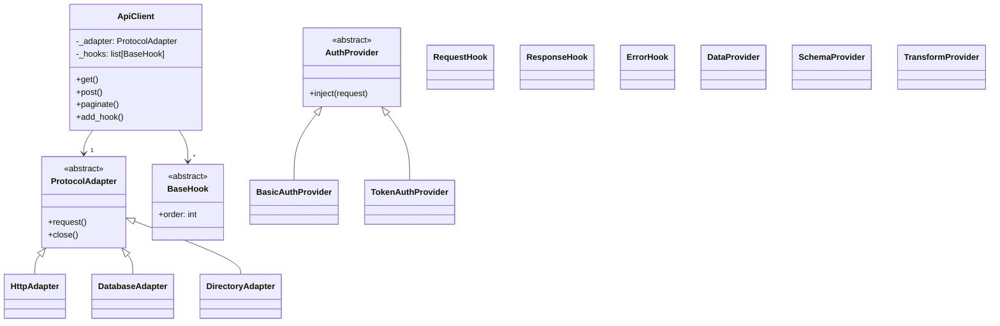

# High-Level Architecture & Class System

dc-api-x is intentionally small at its **core** yet endlessly extensible through
a well-defined class hierarchy.  
This document dives deeper than the overview—clarifying **every base class,
ABC, mix-in, and "do-not-override" rule**—so plugin authors and core
contributors share a common model.

---

## 0 ▸ TL;DR Decision Tree

```text
Need new protocol?    → subclass ProtocolAdapter  → register_adapters
Need new auth scheme? → subclass AuthProvider     → register_auth_providers
Need request tweak?   → subclass RequestHook      → pass in ApiClient
Need X-to-Y transform?→ subclass TransformProvider→ add to provider registry
```

If you find yourself subclassing **ApiClient** directly, stop—99 % of use-cases
fit one of the interfaces above.

---

## 1 ▸ Component Diagram (v2)



---

## 2 ▸ Class Contracts

### 2.1 `ProtocolAdapter` (ABC)

| Method                                     | Mandatory                       | Notes                                                      |
| ------------------------------------------ | ------------------------------- | ---------------------------------------------------------- |
| `request(self, method, path, **kwargs)`    | **Yes** for HTTP-like protocols | Must return `ApiResponse` or raise subclass of `ApiError`. |
| `query(self, sql, params=None)`            | For SQL engines                 | Returns iterable of records.                               |
| `search(self, base_dn, filter_expr, **kw)` | For directory protocols         | Returns list of `ldap3.Entry`.                             |
| `close(self)`                              | **Yes**                         | Idempotent; free pools/clients.                            |

*Mark a method with `@final` if subclasses should not override it.*

### 2.2 `AuthProvider` (ABC)

* **Stateless** – create once, share across many adapters.
* Must implement `inject(request)` and mutate headers/auth field **in-place**.
* Never store secrets in `__repr__` / log.

### 2.3 Hook Interfaces

| Hook                            | Called                  | Must return                                         |
| ------------------------------- | ----------------------- | --------------------------------------------------- |
| `RequestHook.handle(request)`   | *Before* adapter call   | Either same or mutated request                      |
| `ResponseHook.handle(response)` | *After* adapter returns | Either same or mutated response                     |
| `ErrorHook.handle(exc)`         | When adapter raises     | Either re-raise or return replacement `ApiResponse` |

Hook **ordering** is controlled by `order: int` attribute (lower → earlier).

### 2.4 Provider Layer

| Provider            | Responsibility                                                 |
| ------------------- | -------------------------------------------------------------- |
| `SchemaProvider`    | Fetch + cache OpenAPI/JSON-Schema; maps to Pydantic models.    |
| `DataProvider`      | Join/merge heterogeneous datasets; emits Pandas DF (optional). |
| `TransformProvider` | Convert adapter payloads into domain DTOs / CSV / Parquet.     |

Providers are **pure**—no network I/O; depend only on adapters.

---

## 3 ▸ Golden OOP Rules

1. **Favor composition**: wrap an adapter inside a hook rather than subclassing.
2. **Stateless singletons**: Providers & Hooks should be reusable.
3. **`__all__` discipline**: expose only public symbols; keep internals private.
4. **No silent `pass`**: raise `NotImplementedError` in abstract stubs.
5. **Use `typing.Final` constants** for registry keys to avoid typos.
6. **Pydantic models frozen** (`model_config = ConfigDict(frozen=True)`) so data
   stays immutable post-validation.
7. **Prevent linting issues**: follow these patterns to avoid common Ruff errors:
   * Prefix unused method args with underscore to avoid `ARG002`
   * Use dataclasses or similar structures when functions need many parameters
   * Always include trailing commas in multi-line collections
   * Use custom exception classes with clear names instead of long messages
   * Catch specific exceptions instead of blind `except Exception`
   * Use `logging.exception()` in exception handlers instead of `logging.error()`
   * Define constants for magic values (HTTP status codes, etc.)
8. **Enforce strict type checking**: maintain mypy compatibility with these practices:
   * Always provide complete type annotations for function parameters and return values
   * Use proper Optional/Union types (`str | None` in Python 3.10+) and add appropriate guards
   * Install type stubs for third-party libraries (`python -m pip install types-requests`)
   * Ensure concrete classes implement all abstract methods from their base classes
   * Avoid returning `Any` from typed functions; perform explicit validation or casting
   * Check for `None` before accessing attributes of optional values
9. **Reduce code complexity**: apply wemake-python-styleguide principles for maintainable code:
   * Limit function complexity by breaking down complex operations
   * Avoid deeply nested control structures (if/for/while)
   * Maintain low cyclomatic complexity (number of decision points)
   * Extract repeated expressions to avoid duplication
   * Keep a reasonable number of local variables per function (<8)
   * Prefer clear, single-purpose functions over complex multi-purpose ones
   * Use meaningful constants instead of string/numeric literals

---

## 4 ▸ Custom Implementation Examples

### 4.1  Kafka Adapter (read-only)

```python
from dc_api_x.ext.adapters import ProtocolAdapter
from confluent_kafka import Consumer

class KafkaConsumerAdapter(ProtocolAdapter):
    """Pulls messages from Kafka and exposes `.poll()` as `get`."""

    def __init__(self, brokers: str, topic: str):
        self._topic = topic
        self._c = Consumer({"bootstrap.servers": brokers, "group.id": "dcapix"})

    def request(self, method: str, path: str = "", **kw):
        if method != "GET":
            raise NotImplementedError
        msg = self._c.poll(timeout=kw.get("timeout", 1))
        if not msg:
            return ApiResponse(success=True, data=None)
        return ApiResponse.success(data=msg.value())

    def close(self):
        self._c.close()
```

### 4.2  HMAC Signing Hook

```python
import hmac, hashlib, base64
from dc_api_x.ext.hooks import RequestHook

class HMACSignHook(RequestHook):
    order = 10
    def __init__(self, secret: str):
        self._key = secret.encode()

    def handle(self, request):
        sig = hmac.new(self._key, request.body or b"", hashlib.sha256).digest()
        request.headers["X-Signature"] = base64.b64encode(sig).decode()
        return request
```

Register in `ApiClient(request_hooks=[HMACSignHook("s3cr3t")])`.

---

## 5 ▸ Adapter Factory Pattern

Large plugins often support *multiple* adapter flavours (sync vs async).
Factory helpers keep `register_adapters` slim.

```python
def register_adapters(reg):
    from .sync_adapter import MySyncAdapter
    from .async_adapter import MyAsyncAdapter

    reg |= {
        "myproto": MySyncAdapter,
        "myproto_async": MyAsyncAdapter,
    }
```

---

## 6 ▸ Class Lifecycle & Memory Management

* **Adapters & Clients** implement `__enter__/__exit__` so `with` releases pools.
* Plugins **must** call their adapter's `.close()` in `atexit.register` when
  they allocate global pools.
* Avoid cyclic refs: prefer weakrefs or store only primitives in closures.

---

## 7 ▸ Advanced Type Tricks

* Use **ParamSpec** and **TypeVar** for generic hooks that preserve signatures.
* Leverage `pydantic.TypeAdapter` to validate 3rd-party objects without copying.
* Adapters returning *lazy* generators should annotate `-> Iterable[T]` and keep
  pagination hidden.
* Use PEP 585 built-in generic types over their `typing` counterparts:

```python
# ✅ Modern PEP 585 style (Python 3.10+)
def process_orders(orders: list[dict[str, any]]) -> dict[str, int]:
    results: dict[str, int] = {}
    for order in orders:
        results[order["id"]] = len(order.get("items", []))
    return results

# ❌ Legacy style (avoid)
from typing import Dict, List
def process_orders_legacy(orders: List[Dict[str, any]]) -> Dict[str, int]:
    # ...
```

* Use the union operator `|` from PEP 604 for cleaner type unions:

```python 
# ✅ Preferred
def get_order(order_id: str | int) -> dict | None:
    # ...

# ❌ Avoid
from typing import Dict, Optional, Union
def get_order_legacy(order_id: Union[str, int]) -> Optional[Dict]:
    # ...
```

---

## 8 ▸ FAQ

| Question                                                  | Answer                                                           |
| --------------------------------------------------------- | ---------------------------------------------------------------- |
| **Can I subclass `HttpAdapter` just to change base-URL?** | No—compose: `ApiClient(url=..., adapter=HttpAdapter(...))`.      |
| **Where do I store global cache?**                        | Inside a hook or provider; never in adapter modules.             |
| **Is async mandatory for new adapters?**                  | Only if the target library is async-native; otherwise stay sync. |
| **Multiple inheritance?**                                 | Forbidden for adapters—clarity over cleverness.                  |

---

> All new base classes or changes to constructor signatures require an **ADR**
> and at least one *major-version* bump consideration.

## Code Complexity Guidelines

To maintain high code quality and adhere to wemake-python-styleguide standards, follow these guidelines for managing code complexity:

### Function and Method Complexity

* **Maximum Cyclomatic Complexity**: Keep function complexity under 10
* **Maximum Arguments**: Limit to 5 parameters per function
* **Maximum Local Variables**: Keep under 8 local variables in any function
* **Maximum Cognitive Complexity**: Keep under 15 (measures how difficult code is to understand)
* **Maximum Line Complexity**: Keep line complexity under 20 (measures complex expressions)

### Module Structure

* **Maximum Imports**: Limit to 15 imports per module
* **Maximum Module Members**: Limit to 15 members (classes/functions/variables) per module
* **Maximum Nesting**: Limit nesting depth to 3 levels
* **Maximum Method Count**: Limit to 10 methods per class

### Organizing Complex Code

When complexity exceeds these limits, refactor using these strategies:

1. **Extract Functions**: Break complex functions into smaller, focused functions
2. **Create Classes**: Use classes to encapsulate related functionality
3. **Module Splitting**: Divide large modules into smaller, focused modules
4. **Use Design Patterns**: Apply appropriate design patterns to manage complexity
5. **Configuration Objects**: Use configuration objects or data classes for functions with many parameters

### Examples

#### Reducing Function Complexity

```python
# ❌ Complex function with high cyclomatic complexity
def process_order(order):
    if not order:
        return None
        
    if not order.items:
        return {"error": "No items in order"}
        
    total = 0
    for item in order.items:
        if item.type == "product":
            price = item.price
            if item.discount:
                price = price * (1 - item.discount)
            total += price * item.quantity
        elif item.type == "service":
            total += item.price
            if item.extras:
                for extra in item.extras:
                    total += extra.price
    
    tax = total * 0.2
    shipping = 0
    if total < 50:
        shipping = 10
    elif total < 100:
        shipping = 5
        
    return {
        "order_id": order.id,
        "subtotal": total,
        "tax": tax,
        "shipping": shipping,
        "total": total + tax + shipping
    }

# ✅ Refactored with lower complexity through function extraction
def calculate_product_price(item):
    price = item.price
    if item.discount:
        price = price * (1 - item.discount)
    return price * item.quantity

def calculate_service_price(item):
    total = item.price
    if item.extras:
        total += sum(extra.price for extra in item.extras)
    return total

def calculate_item_price(item):
    if item.type == "product":
        return calculate_product_price(item)
    elif item.type == "service":
        return calculate_service_price(item)
    return 0

def calculate_subtotal(items):
    return sum(calculate_item_price(item) for item in items)

def calculate_shipping(subtotal):
    if subtotal < 50:
        return 10
    elif subtotal < 100:
        return 5
    return 0

def process_order(order):
    if not order:
        return None
        
    if not order.items:
        return {"error": "No items in order"}
    
    subtotal = calculate_subtotal(order.items)
    tax = subtotal * 0.2
    shipping = calculate_shipping(subtotal)
    
    return {
        "order_id": order.id,
        "subtotal": subtotal,
        "tax": tax,
        "shipping": shipping,
        "total": subtotal + tax + shipping
    }
```

#### Managing Module Complexity

When a module grows too large:

```python
# ❌ models.py with too many classes
# class User
# class Product
# class Order
# class Payment
# class Shipping
# class Inventory
# class Category
# class Discount
# class Review
# class Cart
# class Wishlist
# class Address
# class Notification
# class Logger
# class Setting

# ✅ Split into submodules
# models/__init__.py - exports all models
# models/user.py - User, Address
# models/product.py - Product, Category, Inventory
# models/order.py - Order, Payment, Shipping
# models/commerce.py - Cart, Wishlist, Discount
# models/engagement.py - Review, Notification
# models/system.py - Logger, Setting
```

These guidelines help maintain readable, maintainable code that passes strict linting checks.
